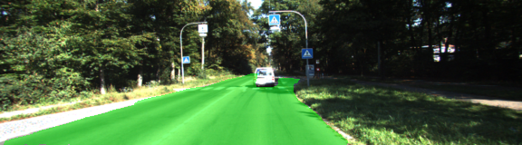
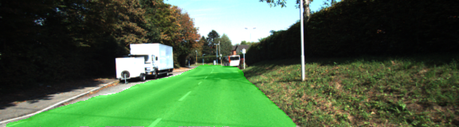
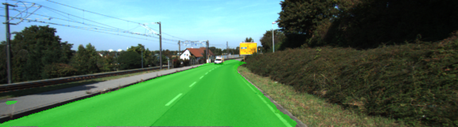
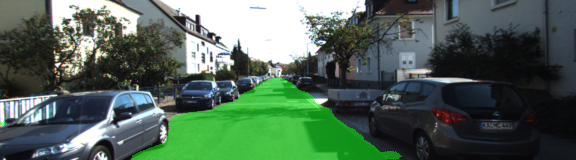

# Semantic Segmentation

## Introduction

Purpoese: carryout semantic segmentation to identify road for car driving.
Model: Fully Convolutional Network (FCN) based on a pre-trained VGG-16 model.
data set: KITTI road dataset

## Instruction

### model

Firstly our code will download a pre-trained VGG16 model, using it's input,keep_prob,layer3,layer4 and layer7, just like transfer learning in previous course.
(main.py, line 21-47)

The whole network was defined in layers() (main.py, line 51-100). All convolutional layers use random-normal kernel initializer with stddev=0.01 and L2 regularizer with L2=0.001.

Then define Adam optimizer and the cross_entropy_lost in optimize() (main.py, line 104-124) 

### Training

The network is trained in train_nn() (main.py, line 128-154). The hyperparameters are:

  - keep_prob: 0.5
  - learning_rate: 0.001
  - epochs: 40
  - batch_size: 5

I choose a relatively latge epochs to make it more possible to get an acceptable result in just one or two runs. (let's trust the model first)

## Results

Actually I found after epoch 30, the loss of the batches are around 0.02-0.03, and don't decrease apparently in following epochs. Some sample images are as following:

